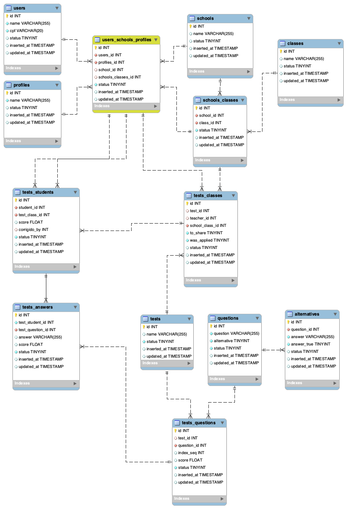

# SchoolTest
The goal of this repository is to be a school activity correction system, following the [`test instructions`](.github/test_arvore.md).

Based on these instructions, I built: [`eer diagram`](.github/diagram.png).


## Requeriments
  * postgres 11.7
  * elixir 1.9.4-otp-22 
  * erlang 22.2.3
  * Phoenix 1.4.13
  

  If you have "asdf" configured on you computer, run ``` asdf install ``` in project folder, to install elixir and erlang.

## Run it
To start your Phoenix server:

  * Install dependencies with `mix deps.get`
  * Configure database access in: `config/dev`
  * Create and migrate your database with `mix ecto.setup`
  * Start Phoenix endpoint with `mix phx.server`

Now you can visit [`localhost:4000/graphiql`](http://localhost:4000/graphiql) from your browser.

## GraphQL
Some queries we can do:

* Get a list of school_class
```graphql
query{
  schoolClass{
    id
    school{
      name
    }
    class{
      name
    }
  }
}
```


* Get a list of users by class
```
query{
	listByClass(schoolClassId: 1){
    user{
      name
	  cpf
    }
    schoolClass{
      school{
        name
      }
      class{
        name
      }
    }
  }
}
```

